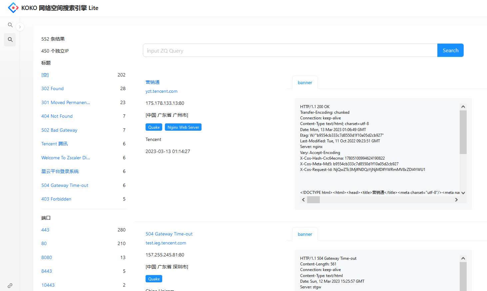
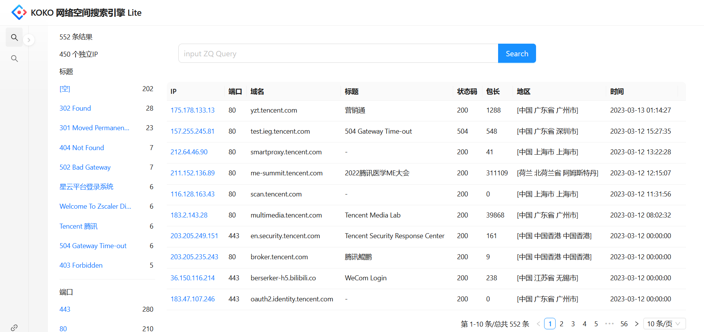
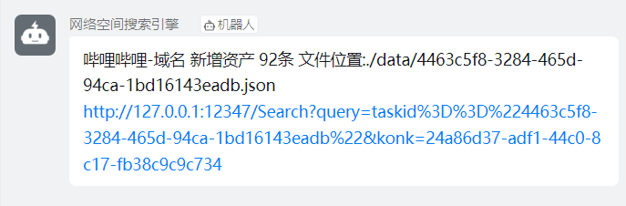

# KOKO-MONI
## 介绍
本项目是一个网络空间搜索引擎监控平台，本项目聚合了 Fofa、Hunter、Quake、Zoomeye 和 Threatbook 的数据源，并对获取到的数据进行去重与清洗。


该项目可以用于蓝方监控自身资产公网暴露以及 SRC 项目新增资产进行监控。
## 功能
- 聚合 Fofa、Hunter、Quake、Zoomeye 和 Threatbook 的数据源，快速查询相关资产信息。
- 自动化监控，可定时进行资产信息爬取，及时发现新增资产。
- 支持钉钉，推送加消息提醒，让您能够及时发现异常情况。
- 提供 Web 检索界面，使得查询操作更加方便。
## 安装
解压安装包

按照config.demo.yaml 内的注释填写配置项 保存为config.yaml

示例配置
``` yaml
global: #全局配置 启动时会触发一次所有的任务
  hunter_key: "" #hunter API key 注意用量  留空不采集
  zoomeye_key: ""
  quake_cookies: "" #quake登陆后 cookies
  threatbook_cookies: "" #微步登陆后  cookies  注意用量 频繁会触发验证码 强制退出登陆
  fofa_email: "" #  FOFA 邮箱
  fofa_key: ""#  FOFA KEY
  save_path: "./data" #数据保存位置
  ip: "127.0.0.1" #api 监听ip
  port: "12347" #api 端口
  secret_key: "123456" #api key 一定要修改
  plus_push_key:  "" #推送加 key 有新增资产会推送
  ding_push_key:  "" #钉钉HOOK推送key
  scan_on_start: true #启动时是否触发一次爬取

jobs:
- name: "one-ip" #任务名 推送用
  schedule: "@daily" #定时采集  支持cron语法 示例 @daily 每天一次 (半夜0点触发 系统时间和时区一定要设置好) 参考 https://pkg.go.dev/github.com/robfig/cron?utm_source=godoc
  hunter_query: "ip=\"1.1.1.1/24\"" # hunter搜索语法 (ps: hunter api获取的banner有问题 )特殊字符注意转义 注意不同搜索引擎使用不同的语法 留空不采集
  hunter_page: 10 #最大爬取页数 每页10条
  quake_query: "ip: \"1.1.1.1/24\""
  quake_page: 50
  threatbook_query: "ip=1.1.1.1/24"
  threatbook_page: 50
  zoomeye_query: "1.1.1.1/24"
  zoomeye_page: 10  #最大爬取页数  每页20条
  fofa_query: "ip=\"1.1.1.1/24\""
  fofa_page: 10
- name: "哔哩哔哩-域名"
  schedule: "@daily"
  hunter_query: "domain=\"bilibili.com\""
  hunter_page: 10
  quake_query: "domain: \"bilibili.com\""
  quake_page: 50
  threatbook_query: "root_domain=bilibili.com"
  threatbook_page: 50
  zoomeye_query: "site:bilibili.com"
  zoomeye_page: 10
  fofa_query: "domain=\"bilibili.com\""
  fofa_page: 10
```

启动 ./koko-moni

## UI
注: web无登陆界面 直接访问 `/?key=secret_key` 鉴权  secret_key不正确时被RST连接为正常现象 key不正确触发反测绘







## 搜索语法

本项目使用了 [ZED](https://github.com/brimdata/zed) 作为结构化数据搜索引擎
可参考[zed官方文档](https://zed.brimdata.io/docs/language/overview)
字段见输出文件

### 简单运算
```
int
tlen >= 0

时间
timestamp >= 2023-01-08T05:55:22.200Z

字符串
title=="404"


```
如果带有特殊符号(中文)的键 根下可以使用 `this[""]` 引用
```
this["status-code"] >10
this["content-length"]==158
非根
abc["测试"]=="123456"

多层复杂json结构
{"a":{"b":{"c":"123"}}}
this["a"].b.c=="123"
{"a":{"b":["123","456"]}}
this["a"].b[0]=="123"
```

### 强制类型转换

```

cast(数据,<类型>)

字符串日期转time

cast("2022-09-19T18:11:05.545961703+08:00",<time>)

字符串ip转ip

cast("1.1.1.1",<ip>)

也可以简写成

time("2022-09-19T18:11:05.545961703+08:00")
ip("1.1.1.1")

用例

cidr_match(1.1.0.0/16,ip(host))  //匹配ip是否在cidr内


time(timestamp) >= 2022-01-08T05:55:22.200Z
```
### 常用操作
#### 排序
升序排序
`sort dns_names` 
降序排序
`sort -r dns_names`
#### in
判断某个值是否在数组内
```
{"test":[301,200]}
200 in test
```


#### 聚合查询
##### 统计计数
`count() by key`
输出  `key,count()`
与sort组合使用
`count() by title|sort -r count`


## API

### 全局参数

鉴权url参数 `key` 

在配置文件中设置(secret_key)


### 测试推送

请求方式: GET

请求URL: `/api/testpush`

请求参数: 无


### 聚合查询

请求方式: GET

请求URL: `/api/aggregate`

请求参数: 

| 参数名 | 必选 | 类型 | 说明 |
| --- | --- | --- | --- |
| current | 是 | int | 当前页数 |
| pageSize | 是 | int | 每页数据量 |
| query | 是 | string | ZQ查询语句 |

响应格式: JSON

响应示例: 

```
{
  "data": {
    "count": 92,
    "elapsed": 226,
    "finger": [
      {
        "finger": "Fofa",
        "count": 75
      },
      {
        "finger": "Hunter",
        "count": 17
      },
      {
        "finger": "Nginx",
        "count": 7
      },
      {
        "finger": "Lua",
        "count": 7
      }
    ],
    "ipcount": 77,
    "port": [
      {
        "port": "443",
        "count": 57
      },
      {
        "port": "80",
        "count": 26
      }
    ],
    "title": [
      {
        "count": 29
      },
      {
        "title": "301 Moved Permanently",
        "count": 16
      },
      {
        "title": "302 Found",
        "count": 11
      }
    ]
  },
  "message": "ok",
  "success": true
}
```

### 搜索

请求方式: GET

请求URL: `/api/search`

请求参数: 

| 参数名 | 必选 | 类型 | 说明 |
| --- | --- | --- | --- |
| current | 是 | int | 当前页数 |
| pageSize | 是 | int | 每页数据量 |
| query | 是 | string | ZQ查询语句 |

响应格式: JSON

响应示例: 

```
{
	"data": [{
		"banner": "HTTP/1.1 403 Forbidden\r\nConnection: close\r\nContent-Length: 9\r\nContent-Type: application/octet-stream\r\nDate: Thu, 16 Feb 2023 17:11:21 GMT\r\nServer: Tengine\r\n\r\n\r\n",
		"body_length": 9,
		"commonname": "",
		"date": "2023-03-13 21:59:41",
		"dnsnames": "",
		"fingerprint": ["Fofa"],
		"host": "1.1.com",
		"ip": "1.1.1.1",
		"loc": "[中国 上海 上海]",
		"organization": "Huawei Cloud Service data center",
		"port": "443",
		"status_code": 403,
		"title": "",
		"tls": "Version:  v3\nSerial Number: 123456546\nSignature Algorithm: SHA256-RSA",
		"url": "https://1.1.com:443/"
	}],
	"message": "ok",
	"success": true,
	"total": 92
}
```